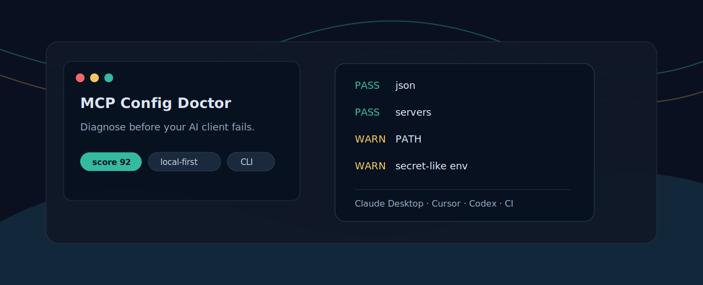
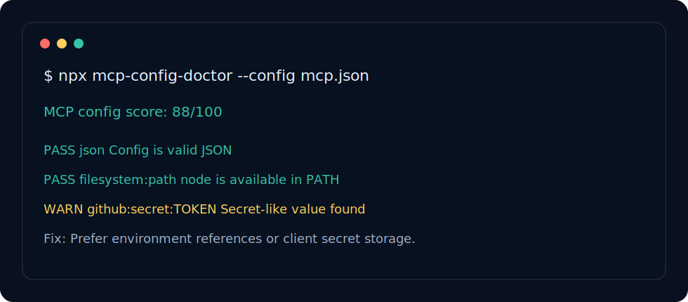

<p align="center">
  
</p>

<h1 align="center">MCP Config Doctor</h1>

<p align="center">
  A local-first CLI that diagnoses MCP config files before Claude Desktop, Cursor, Codex, or another AI client fails to connect.
</p>

<p align="center">
  <a href="README.zh-CN.md">中文</a>
  ·
  <a href="#quick-start">Quick start</a>
  ·
  <a href="#checks">Checks</a>
  ·
  <a href="#contributing">Contributing</a>
</p>

<p align="center">
  
  <a href="https://www.npmjs.com/package/mcp-config-doctor"></a>
  <a href="https://github.com/aolingge/mcp-config-doctor/actions/workflows/validate.yml"></a>
  
  
</p>

## Why This Exists

MCP is becoming the standard way to connect AI clients with tools, files, APIs, and local services. The rough edge is setup: one wrong JSON key, missing command, broken PATH, or pasted token can make the client fail with a vague error.

`mcp-config-doctor` gives you a fast preflight check:

- Finds JSON and schema mistakes in MCP client config files.
- Checks local commands, `args`, `env`, URLs, and common secret leaks.
- Prints clean terminal, JSON, or Markdown reports for issues and pull requests.
- Runs locally and does not send your config anywhere.

<p align="center">
  
</p>

## Quick Start

```bash
npx mcp-config-doctor --config claude_desktop_config.json
```

Generate a Markdown report:

```bash
npx mcp-config-doctor --config mcp.json --markdown > mcp-report.md
```

Use it in CI and fail below a score:

```bash
npx mcp-config-doctor --config fixtures/valid.mcp.json --min-score 80
```

Run a short startup probe for local stdio servers:

```bash
npx mcp-config-doctor --config mcp.json --start
```

Run an MCP initialize handshake probe for local stdio servers:

```bash
npx mcp-config-doctor --config mcp.json --initialize
```

## Checks

| Check | What it catches | Why it matters |
| --- | --- | --- |
| JSON parse | Invalid config syntax | Clients often hide the exact parse error |
| `mcpServers` / `servers` | Missing or empty server block | Most clients need one of these shapes |
| `command` / `url` | Missing launch target | Local and remote MCP servers use different targets |
| PATH lookup | Command is not installed or not visible | A server can work in your terminal but fail in the client |
| `args` type | String instead of array | Common copy-paste mistake |
| `env` type | Wrong environment format | Prevents server startup |
| Secret-like values | Tokens pasted into config | Keeps public reports safer |
| Startup probe | Immediate process exit | Finds broken local stdio servers early |
| Initialize probe | Missing MCP initialize response | Confirms a local stdio server speaks MCP before a client starts it |

## Example Config

```json
{
  "mcpServers": {
    "filesystem": {
      "command": "node",
      "args": ["server.js"],
      "env": {
        "ROOT": "."
      }
    },
    "remote-api": {
      "url": "https://example.com/mcp"
    }
  }
}
```

## Safety Boundary

This tool is a config doctor, not a security scanner. It detects common setup mistakes and obvious secret-like strings, but it does not prove that an MCP server is safe. Review every server you install, especially tools that can read files, run commands, or access private APIs.

`--start` and `--initialize` are explicit opt-ins because they execute local server commands from your config. `--initialize` sends only a minimal MCP `initialize` JSON-RPC request over stdio and waits briefly for a response; it does not call tools, read resources, or send your config anywhere.

## Roadmap

- More built-in config path detection for Claude Desktop, Cursor, Codex, Cline, and Windsurf.
- SARIF and GitHub Actions annotations.
- Safer redaction helper for sharing reports publicly.
- More real-world fixtures from community pull requests.

## Contributing

Good first contributions are welcome: add a client config path, add a fixture, improve a check message, or document a client-specific setup trap.

See [CONTRIBUTING.md](CONTRIBUTING.md) for the workflow.

## License

MIT


## Quality Gate

Use this project as a repeatable gate before an AI agent marks work as done:

- [Quality gate guide](docs/quality-gates.md)
- [Copy-ready GitHub Actions example](examples/github-action.yml)
- [Release readiness](docs/release-readiness.md)
- [Launch notes](docs/launch.md)
