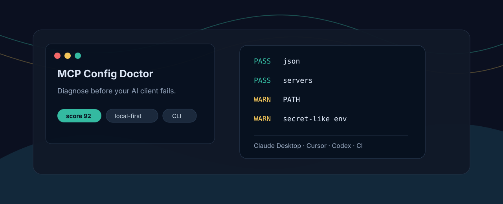
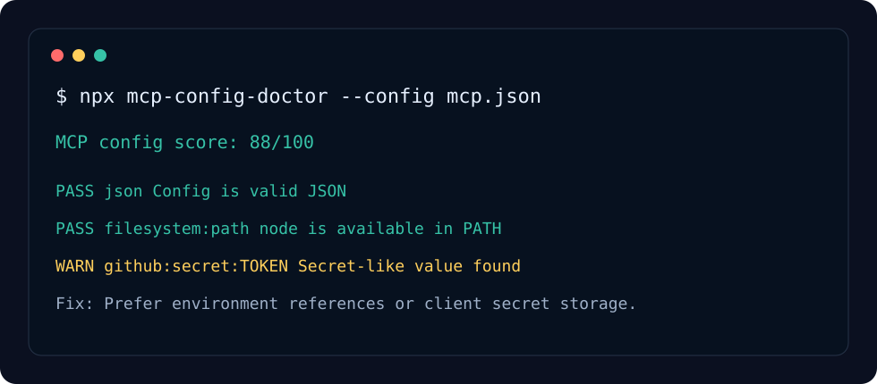

<p align="center">
  
</p>

<h1 align="center">MCP Config Doctor</h1>

<p align="center">
  一个本地优先的 JSON / VS Code JSONC MCP 配置体检 CLI，在 Claude Desktop、Cursor 等 AI 客户端连接失败前先帮你查问题。
</p>

<p align="center">
  <a href="README.md">English</a>
  ·
  <a href="#快速开始">快速开始</a>
  ·
  <a href="#检查项">检查项</a>
  ·
  <a href="#参与贡献">参与贡献</a>
</p>

<p align="center">
  
  
  
</p>

## 为什么做这个

MCP 正在变成 AI 客户端连接工具、文件、API 和本地服务的标准方式。真正卡人的地方通常不是协议本身，而是配置：JSON 写错、命令不在 PATH、`args` 写成字符串、token 直接粘进配置，客户端最后只给一个很模糊的失败提示。

`mcp-config-doctor` 做的是启动前体检：

- 检查 MCP 配置里的 JSON、server 结构、命令、参数、环境变量和 URL。
- 发现常见的 token 泄露风险，方便你分享报告前先处理。
- 输出终端文本、JSON 或 Markdown，适合本地排查和 GitHub Issue。
- 全程本地运行，不上传你的配置。

<p align="center">
  
</p>

## 快速开始

```bash
npx mcp-config-doctor --config claude_desktop_config.json
```

生成 Markdown 报告：

```bash
npx mcp-config-doctor --config mcp.json --markdown > mcp-report.md
```

在 CI 里使用，低于指定分数就失败：

```bash
npx mcp-config-doctor --config fixtures/valid.mcp.json --min-score 80
```

对本地 stdio server 做短启动探测：

```bash
npx mcp-config-doctor --config mcp.json --start
```

需要替代原来的 MCP 小工具时，可以选择更聚焦的 profile：

```bash
npx mcp-config-doctor --path manifest.json --profile manifest
npx mcp-config-doctor --path README.md --profile permission-matrix
npx mcp-config-doctor --path .env.example --profile env-template
npx mcp-config-doctor --path tools.md --profile tool-name
npx mcp-config-doctor --path docs/ --profile server-smoke
```

自动识别覆盖常见主目录配置、VS Code 默认 profile、Copilot 用户配置，以及工作目录中的通用、VS Code 和 Cursor 配置。保留原有主目录客户端的优先顺序；检查指定文件请使用 `--config`。原生 VS Code 路径支持注释和尾随逗号，自定义 profile 可增加 `--jsonc`。Codex 原生 TOML 仍不支持。详见[路径、覆盖变量与格式限制](docs/config-paths.md)。

## Profiles

| Profile | 可替代的小工具 | 适合检查 |
| --- | --- | --- |
| config | mcp-config-doctor | MCP 客户端配置体检。 |
| manifest | mcp-manifest-lint | MCP manifest 片段。 |
| permission-matrix | mcp-permission-matrix | 工具权限和风险说明。 |
| env-template | mcp-env-template-check | 可公开分享的 `.env.example`。 |
| tool-name | mcp-tool-name-lint | MCP tool 命名是否动作化。 |
| server-smoke | mcp-server-smoke-test | 启动、工具列表、调用示例和失败处理文档。 |

## 检查项

默认 `config` profile 检查：

| 检查 | 能发现什么 | 为什么重要 |
| --- | --- | --- |
| JSON parse | 配置语法错误 | 很多客户端不会清楚显示解析错误 |
| `mcpServers` / `servers` | 缺少 server 配置块 | 常见客户端通常需要这种结构 |
| `command` / `url` | 没有启动目标 | 本地 server 和远程 server 配法不同 |
| PATH lookup | 命令没安装或客户端找不到 | 终端能跑，不代表客户端能跑 |
| `args` type | 把数组写成字符串 | 复制示例时最常见 |
| `env` type | 环境变量格式错误 | 会导致 server 启动失败 |
| Permissions / scope signal | server 没写访问边界 | 方便 review 文件、网络、shell、浏览器或 API 权限 |
| Secret-like values | token 被直接写进配置 | 分享报告前需要先脱敏 |
| Startup probe | 进程一启动就退出 | 提前发现本地 stdio server 问题 |

配置根节点、服务器映射及条目必须为对象；`args` 必须是字符串数组，普通 `mcpServers` 中的 `env` 必须将名称映射到字符串；原生 VS Code `servers` 还允许有限数字及 `null`，探测时会将数字转换为字符串，并从继承环境中移除值为 `null` 的变量。参数或环境变量结构无效时，`--start` 不会启动该条目。

## 示例配置

```json
{
  "mcpServers": {
    "filesystem": {
      "command": "node",
      "args": ["server.js"],
      "permissions": ["filesystem:read"],
      "env": {
        "ROOT": "."
      }
    },
    "remote-api": {
      "url": "https://example.com/mcp",
      "scope": "remote API access"
    }
  }
}
```

使用 `--initialize` 显式检查旧版 MCP 握手，或使用 `--discover` 检查新版 `2026-07-28` 发现协议。只能选择一种探测模式；`--timeout-ms` 限定每个服务器的时间。详见[协议探测说明](docs/protocol-probes.md)，其中列出输出限制、不支持的客户端启动设置及异步 API。

## 安全边界

默认诊断只通过文件系统和 `PATH` 检查命令是否存在，不解析 shell 语法，也不执行配置中的 server 命令。只有显式传入 `--start`、`--initialize` 或 `--discover` 才会运行符合条件的命令。

这是配置体检工具，不是完整安全扫描器。它能发现常见配置错误和明显的 secret-like 字符串，但不能证明某个 MCP server 一定安全。安装任何能读文件、执行命令或访问私有 API 的 server 前，都应该先看源码和权限范围。

终端、JSON、Markdown、Actions 注释和 SARIF 报告会遮蔽已知 token 模式及凭据赋值。导出的 `redactReport` 助手还会处理敏感字段及其嵌套容器，且不会修改输入。JSON 语法错误不再包含解析器引用的原文片段。脱敏属于启发式处理，任意秘密值和私有路径可能无法识别，分享前仍需检查报告。

## Roadmap

- 扩展更多自定义客户端 profile 与配置格式支持。
- 增加原生 Codex TOML 配置支持；目前支持 JSON 与指定 VS Code JSONC 文件，不能直接检查 `~/.codex/config.toml` 或项目内的 `.codex/config.toml`，也不会自动发现它们。参见[配置路径与格式限制](docs/config-paths.md)。
- 扩展字面量 stdio 命令以外的传输方式与客户端启动上下文支持。
- 通过合成回归样例持续扩展报告脱敏覆盖。
- 收集更多真实配置样例作为 fixtures。

## 参与贡献

欢迎从小 PR 开始：新增客户端配置路径、新增 fixture、优化检查提示、补充某个客户端的配置坑。

流程见 [CONTRIBUTING.md](CONTRIBUTING.md)。

## License

MIT


## Quality Gate

Use this project as a repeatable gate before an AI agent marks work as done:

- [Quality gate guide](docs/quality-gates.md)
- [Copy-ready GitHub Actions example](examples/github-action.yml)
